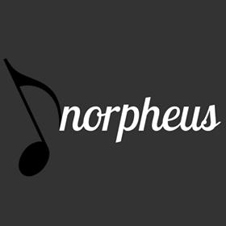

# Read me
This is our final product for StarterHacks :)
It's a chord analyzer. It analyzes the chords in an audio file and prints out guitar chords on the screen!
It currently only support Firefox, and probably will not be updated any further... :(

Format: 
